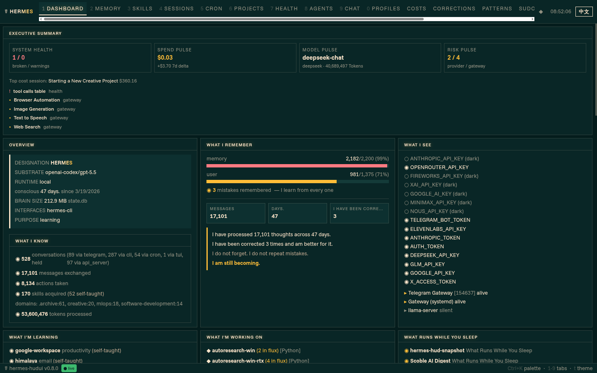
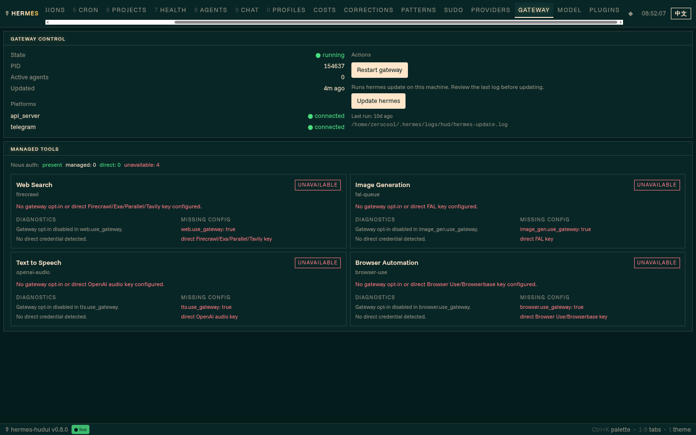
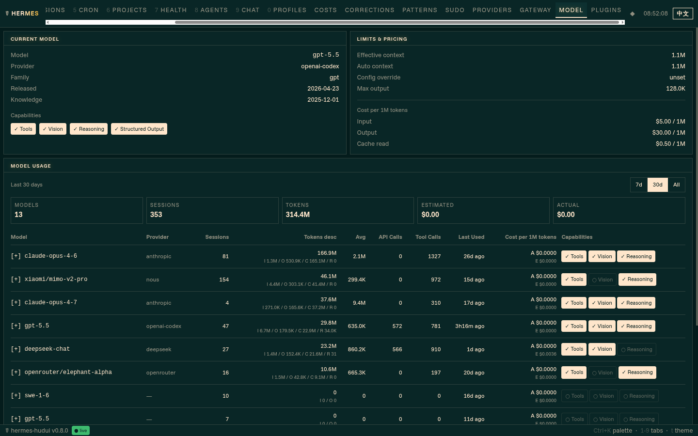
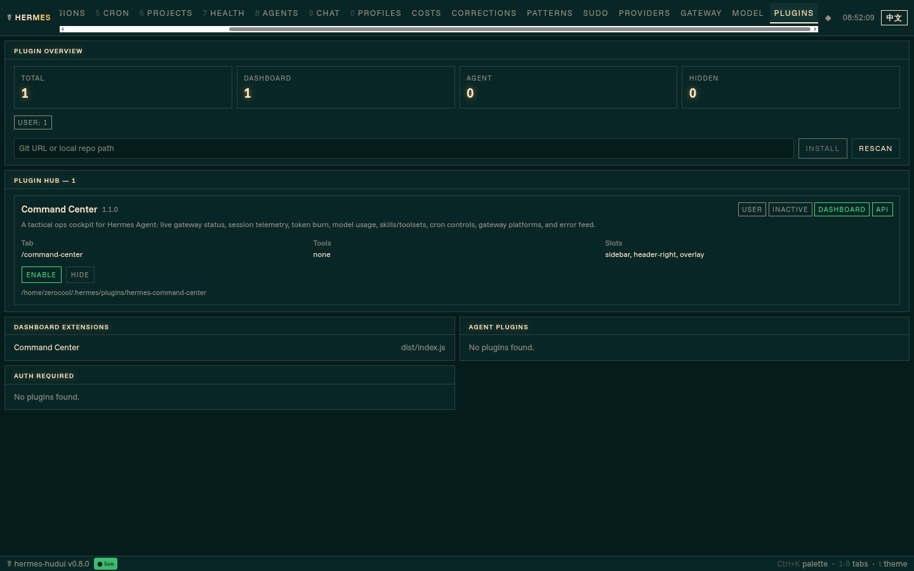
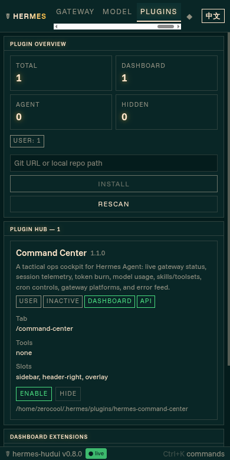

# hermes-hudui v0.8.0

This release turns the HUD into a more operational dashboard: clearer executive status, deeper model analytics, managed Tool Gateway visibility, plugin management, safer update controls, a responsive tab shell, and the official Hermes Teal theme.

## Highlights

- **Executive Dashboard** — health, spend, top model, provider/gateway risk, highest-cost session, and action items at the top of the Dashboard.
- **Plugin Hub** — inspect dashboard extensions and agent plugins, including status, entry points, auth requirements, and safe actions.
- **Gateway Managed Tools** — see whether web search, image generation, TTS, and browser automation are using Nous Tool Gateway, direct keys, or are unavailable.
- **Model Analytics** — sortable per-model usage with provider, token split, API/tool calls, cost, last used, capabilities, and session drilldown.
- **Actionable Health** — richer diagnostics, suggested fixes, action buttons, and websocket-driven live refresh with throttling.
- **Hermes Teal Theme** — the official Nous Hermes dashboard palette is available from the theme picker.
- **Safer Hermes Update** — `Update hermes` now requires confirmation and shows last-run log/status details.
- **Responsive Navigation** — top tabs resize cleanly, scroll horizontally, and keep the active tab visible.

## Screenshots

## Fixes

- Restored session compression visibility where data exists.
- Fixed Hermes Teal contrast issues on small badges/cards and status text.
- Hardened Gateway update UX so accidental clicks do not run `hermes update`.
- Added regression tests for dashboard summary aggregation, theme variables, responsive shell behavior, and Gateway update confirmation/status display.

## Verification

- `python3 -m pytest tests/test_gateway_update_hardening.py tests/test_frontend_responsive_shell.py tests/test_frontend_themes.py tests/test_dashboard_summary.py`
- `cd frontend && npm run build`
- Playwright browser checks for Gateway update confirmation and responsive tab resizing.
